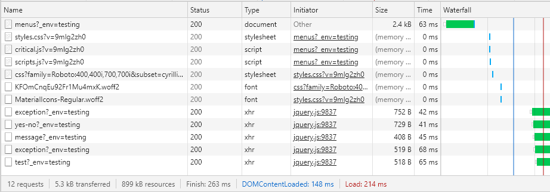
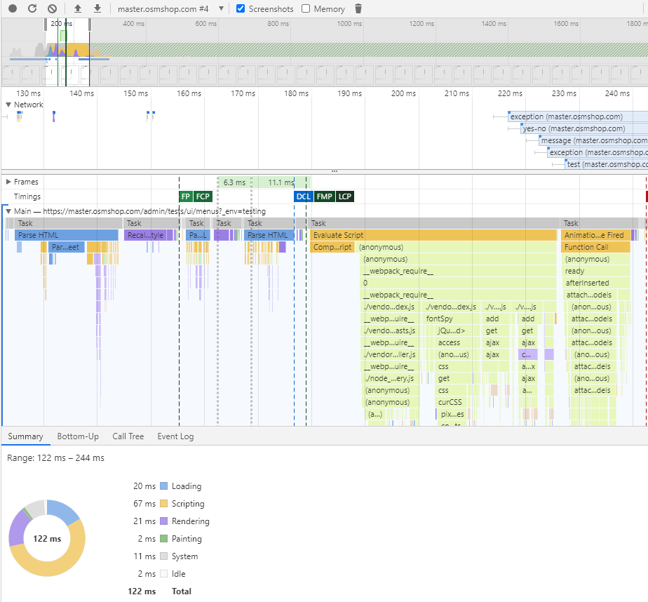

# Better Page Performance

{{ toc }}

## Current Performance

Under profiler (without profiler everything seems ~50% faster), the modest `GET /tests/ui/menus` page network tab shows 

    
Profiler shows (time axis is shifted ~30ms):

     

## Optimization Ideas

* **Remove `critical.js`** and reorganize all JS scripts as attributes (as in Magento 2). We can rely more on media queries and only run `onResize()` methods after page is loaded. 

    * Just removing `critical.js` from the page source doesn't show any effect.
    * There are still lots of scripts tags, each handled in ~1ms   
    
* **Remove custom fonts**.

    * Just removing all fonts gives ~10ms boost. The second (out of three) style recalculation is gone which is ~10ms.     