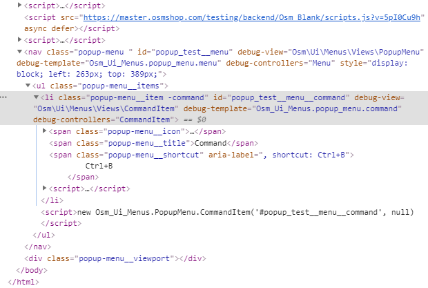
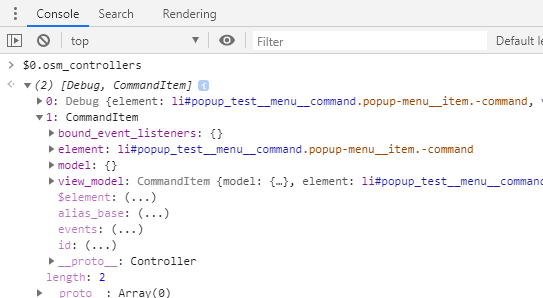
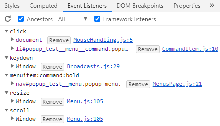

# Inspecting Views And JS Controllers

{{ toc }}

## Rendering View Debug Information

1. Enable `debug_views` setting in project's `config/settings.php` file:

        <?php
        
        return [
            'debug_views' => true,
        ];
        
2. Refresh the page and check the view debug information in the browser's `Developer Tools -> Elements` tab:

    
    
## Meaning Of `debug-` Attributes            

* `debug-view` - PHP view class used to render the element and its child elements
* `debug-template` - Blade template used to render the element and its child elements
* `debug-controllers` - JS controllers attached to the element

## Inspecting JS Controllers

Select an element in the `Developer Tools -> Elements` tab and then in console enter:

    $0.osm_controllers

You should see and be able to inspect all JS controller objects attached to the element:

**Note**. `$0.osm_controllers` may differ from `debug-controllers` attribute as the former fetches current situation and the latter shows controllers attached to the element when the page was loaded.

## Inspecting Event Listeners

Select and element in the `Developer Tools -> Elements` tab and open `Event Listeners` tab. Unlike most JS frameworks, you can see actual controller class files handling the events:

## Visualizing Views And Controllers

You can add a `-debug` modifier to the `<body>` element and all the views and JS controllers will be colored with the shades of red, the deeper, the darker.

## Computing View's `debug_selector` Property

Internally, the framework adds the debug information to the HTML element by finding the element by its ID. It works well if you render the element's ID in the Bade template.

If not, provide the CSS selector to be used to find the element in the `default()` method:

    protected function default($property) {
        switch ($property) {
            case 'debug_selector': return '.snack-bar-panel';
        }
        return parent::default($property);
    }

